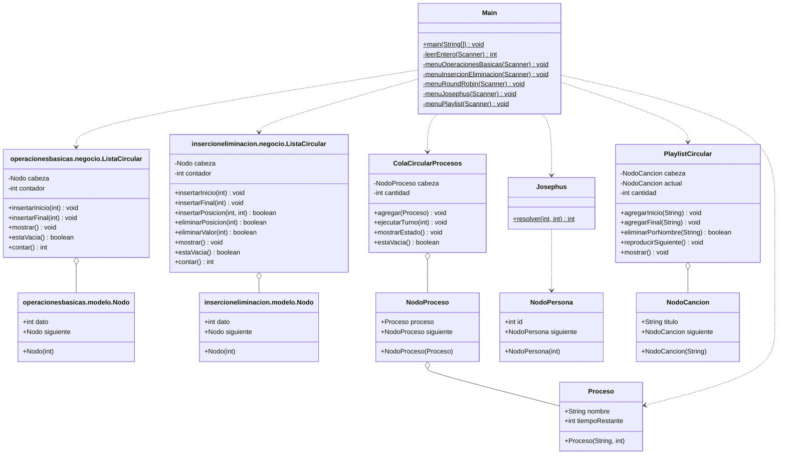

# Diagrama de clases global - Listas Circulares

Todas las clases del programa, agrupadas por paquete. Hay dos `Nodo` y
dos `ListaCircular` porque el ejercicio 1 y el 2 son paquetes distintos:
no comparten codigo.

Vista grafica: `diagrama-clases.png`.

Los diagramas de cada ejercicio (mas detallados, con todos los metodos)
siguen en `src/<paquete>/diagramas/`.

## Relaciones

| Desde | Hasta | Tipo | Por que |
|---|---|---|---|
| `ListaCircular` (ej. 1 y 2) | `Nodo` | agregacion | la lista posee los nodos del circulo |
| `ColaCircularProcesos` | `NodoProceso` | agregacion | la cola posee los nodos |
| `NodoProceso` | `Proceso` | agregacion | el nodo guarda el proceso |
| `PlaylistCircular` | `NodoCancion` | agregacion | la playlist posee las canciones |
| `Josephus` | `NodoPersona` | dependencia | clase utilitaria: crea el circulo, no lo guarda como campo |
| `Main` | cada TDA | dependencia | instancia y llama; no hereda ni agrega |
