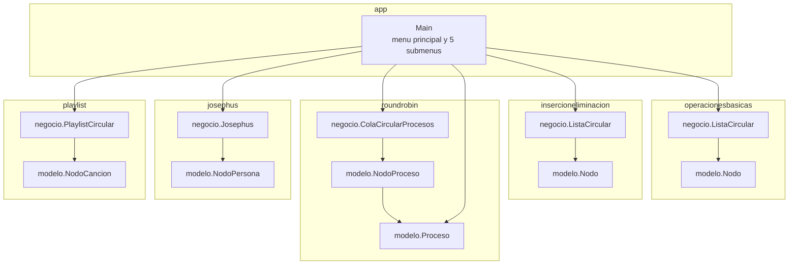
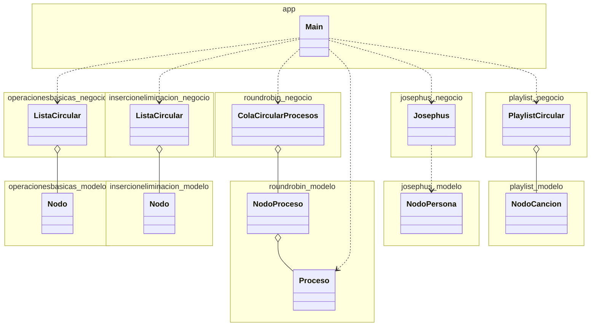

# Diagrama de paquetes - Listas Circulares

Seis paquetes Java en un solo programa. `app` es el unico punto de entrada.
Cada ejercicio tiene su propio `modelo` y `negocio`; los cinco ejercicios
**no se importan entre si**.

Vista grafica: `diagrama-paquetes.png`.

## Dependencias entre paquetes

| Paquete | Contiene | Depende de |
|---|---|---|
| `operacionesbasicas.modelo` | `Nodo` | nada |
| `operacionesbasicas.negocio` | `ListaCircular` | `operacionesbasicas.modelo` |
| `insercioneliminacion.modelo` | `Nodo` | nada |
| `insercioneliminacion.negocio` | `ListaCircular` | `insercioneliminacion.modelo` |
| `roundrobin.modelo` | `Proceso`, `NodoProceso` | nada |
| `roundrobin.negocio` | `ColaCircularProcesos` | `roundrobin.modelo` |
| `josephus.modelo` | `NodoPersona` | nada |
| `josephus.negocio` | `Josephus` | `josephus.modelo` |
| `playlist.modelo` | `NodoCancion` | nada |
| `playlist.negocio` | `PlaylistCircular` | `playlist.modelo` |
| `app` | `Main` | los cinco `negocio` (y `roundrobin.modelo.Proceso` para instanciar) |

`negocio` nunca importa otro ejercicio. El tipo concreto de nodo lo crea
el TDA de su propio paquete. `Main` solo instancia `Proceso` a mano porque
el enunciado de Round-Robin pide nombre y tiempo restante por teclado.
