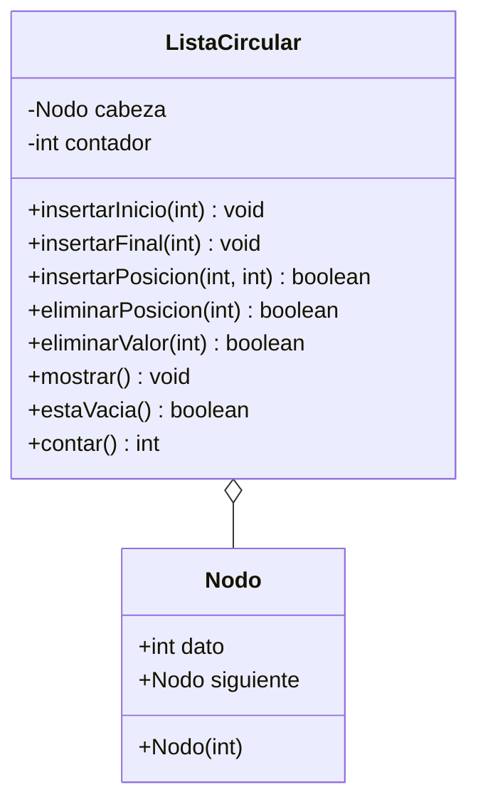

# Diagrama de clases - Insercion y eliminacion controlada

`ListaCircular` inserta y elimina por posicion (base 0) y por valor.
`insertarInicio` e `insertarFinal` son auxiliares de `insertarPosicion`
cuando la posicion es la cabeza o el final.

Vista grafica: `diagrama-clases.png`.

Paquetes Java: `insercioneliminacion.modelo` y `insercioneliminacion.negocio`.

