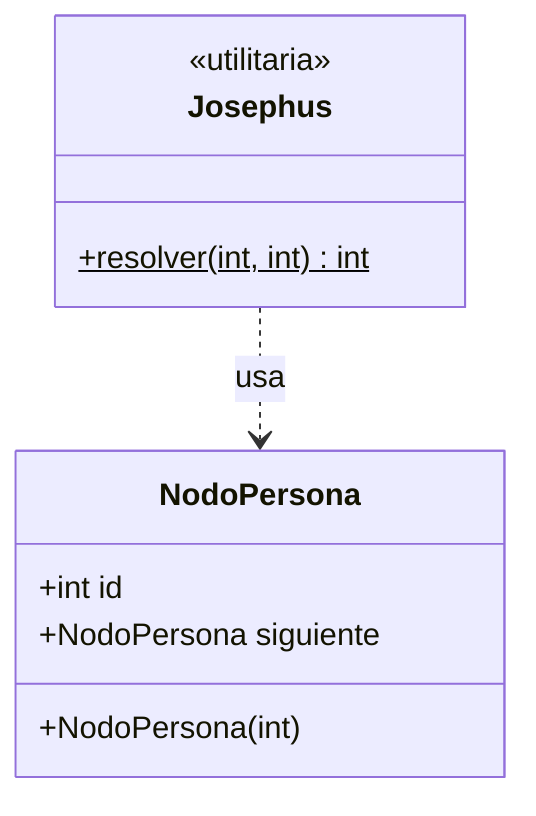

# Diagrama de clases - Josephus

`Josephus` es una clase utilitaria: `resolver(n, k)` construye el circulo
de `NodoPersona` y lo recorre eliminando cada k-esima persona. No guarda
la lista como atributo.

Vista grafica: `diagrama-clases.png`.

Paquetes Java: `josephus.modelo` y `josephus.negocio`.

