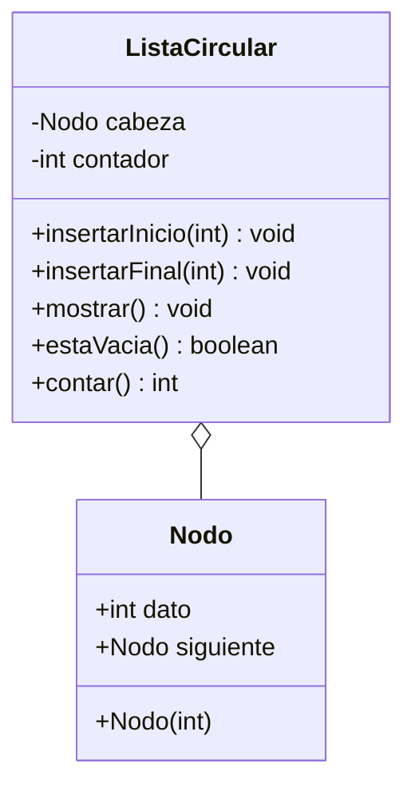

# Diagrama de clases - Operaciones basicas

`ListaCircular` administra el circulo de enteros. `Nodo` guarda el dato
y el enlace al siguiente (el ultimo apunta otra vez a la cabeza).

Vista grafica: `diagrama-clases.png`.

Paquetes Java: `operacionesbasicas.modelo` y `operacionesbasicas.negocio`.

