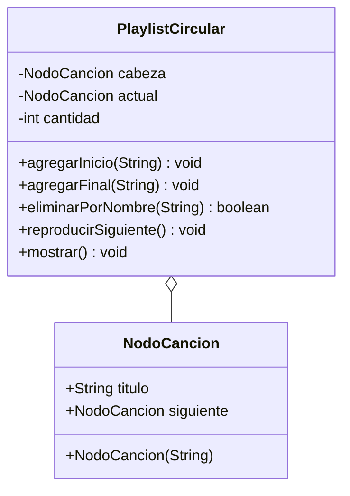

# Diagrama de clases - Playlist circular

`PlaylistCircular` tiene dos referencias a `NodoCancion`: `cabeza` (inicio
de la lista) y `actual` (cancion en reproduccion). El ultimo nodo apunta
a la cabeza, asi `reproducirSiguiente` da la vuelta solo.

Vista grafica: `diagrama-clases.png`.

Paquetes Java: `playlist.modelo` y `playlist.negocio`.

