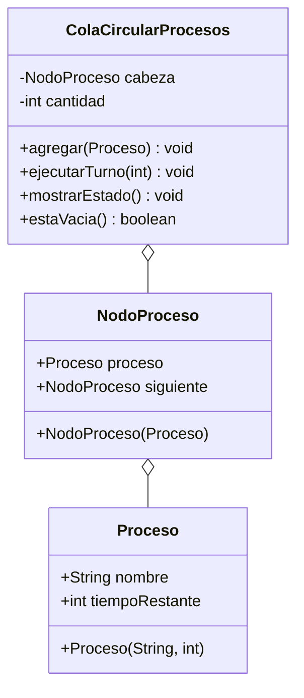

# Diagrama de clases - Round-Robin

`ColaCircularProcesos` es el TDA. Cada `NodoProceso` guarda un `Proceso`
(nombre y tiempo restante) y el enlace al siguiente. El quantum lo recibe
`ejecutarTurno`; no es un campo de la cola.

Vista grafica: `diagrama-clases.png`.

Paquetes Java: `roundrobin.modelo` y `roundrobin.negocio`.

